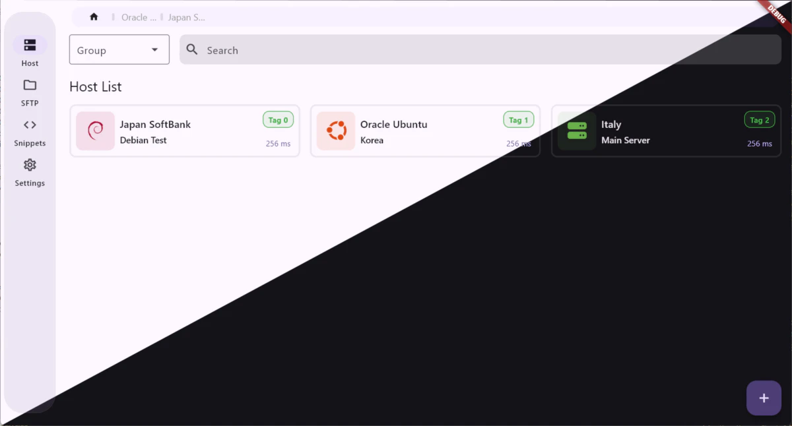

English | [简体中文](docs/README.zh-CN.md)

# Terminflow

A cross-platform SSH terminal / SFTP tool that focuses on privacy, local priority, open source, and ready-to-use Termius alternatives.

You can synchronize your SSH connection information at will and provide a modern page and operation method based on Material Design 3.
 
Developed based on <a href="https://github.com/TerminalStudio/dartssh2">dartssh2</a> & <a href="https://github.com/TerminalStudio/xterm.dart">xterm.dart</a>

## 🦿 Development Progress

The project is currently under development and no version has been released yet. You can keep following this project's progress, or submit your suggestions through [GitHub Discussions](https://github.com/gaowanliang/Terminflow/discussions).

- [x] SSH Connection
  - [x] Password Authentication
  - [x] Key-based Authentication
  - [ ] Bastion Host Login
  - [ ] Proxy Login
- [ ] SFTP File Transfer
- [ ] Code Snippets
- [ ] Session Synchronization
  - [x] S3 and compatible services (tested platforms: [Cloudflare R2](https://www.cloudflare.com/developer-platform/products/r2/))
  - [ ] WebDAV
  - [ ] OneDrive
- [ ] Security Encryption
- [x] Multi-language Support
  - [x] English
  - [x] Simplified Chinese

## 📝 License

This project uses the `GPL-3.0` open source license, for more information please refer to the [LICENSE](../LICENSE) file.

## 🙏 Acknowledgements

This project refers to some code of the following projects at the beginning of the design:

[flutter_server_box](https://github.com/lollipopkit/flutter_server_box)

[xanssh](https://github.com/xanxushu/xanssh)
