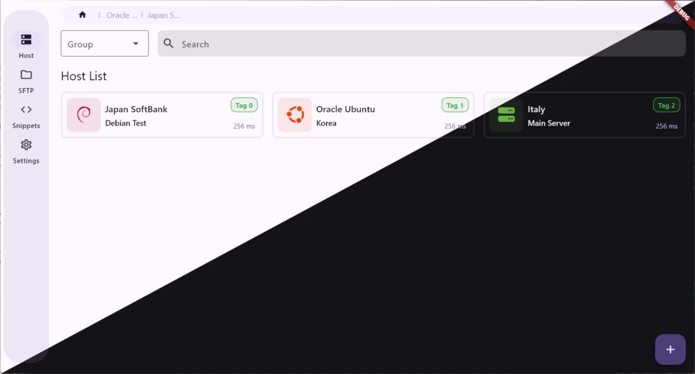

[English](../Readme.md) | 简体中文

# Terminflow

一个跨平台的 SSH终端/SFTP 工具，是注重隐私、本地优先、开源、即用型的Termius替代品。

可以任意同步您的 SSH 链接信息，并提供基于 Material Design 3 的现代化页面和操作方式。
 
基于 <a href="https://github.com/TerminalStudio/dartssh2">dartssh2</a> 和 <a href="https://github.com/TerminalStudio/xterm.dart">xterm.dart</a> 开发。

## 🦿 开发进度

目前项目处于开发阶段，暂未发布任何版本。您可以持续关注本项目的进度，或者通过 [GitHub Discussions](https://github.com/gaowanliang/Terminflow/discussions) 提交您的建议。

- [x] SSH 连接
  - [x] 密码登录
  - [x] 密钥登录
  - [ ] 跳板机登录
  - [ ] 代理登录
- [ ] SFTP 文件传输
- [ ] 代码片段
- [ ] 会话同步
- [ ] 安全加密
- [x] 多语言支持
  - [x] 英语
  - [x] 简体中文

## 📝 协议

本项目使用 `GPL-3.0` 开源协议，详细信息请查看 [LICENSE](../LICENSE) 文件。

## 🙏 鸣谢

本项目在设计之初参考了以下项目的部分代码：

[flutter_server_box](https://github.com/lollipopkit/flutter_server_box)

[xanssh](https://github.com/xanxushu/xanssh)
